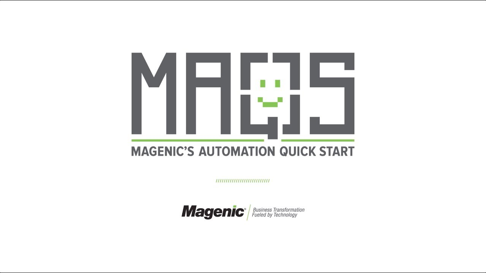

#  MAQS

## Introduction to MAQS
MAQS stands for Magenic's automation quick start.

It …
 - is a modular test automation framework
 - can be used as the base for your automation project or individual pieces can be used to enhance existing frameworks
 - is maintained/extended by Magenic volunteers

The main idea behind MAQS is to avoid **reinventing the wheel**. Most automation engagements have you doing the same basic steps to get a functioning framework implemented. Utilizing project templates, NuGet, and utility libraries we are able to have a functioning framework up and running in minutes, almost entirely removing on the initial time investment on implementating an automation solution.

