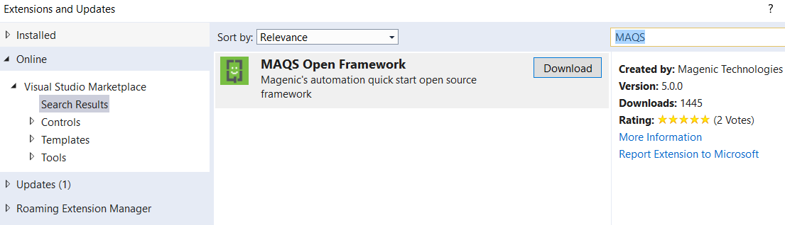

#  Installation

## Requirements
Visual Studio Professional (or Enterprise) 2015 or above.

*We highly recommend using Visual Studio 2017 or above*

## There are 2 ways to install MAQS Templates:
    Option 1. Install via Visual Studio 
    Option 2. Install via Marketplace

## Option 1. Install MAQS Templates Using Visual Studio
1. Open Visual Studio and open "Extensions and Updates"  

### 

2. Find and download MAQS  

### 

## Option 2. Install MAQS Templates Using The VS Marketplace
The MAQS Visual Studio Extension contains a collection of templates for NUnit, VSTest, Test Classes, and Page Models.
It can be downloaded from the [Microsoft Marketplace](https://marketplace.visualstudio.com/items?itemName=vs-publisher-1465771.MAQSOpenFramework)

&nbsp;

For next steps, check our [Getting Started guide](MAQS_5.0.0/Getting-Started.md).