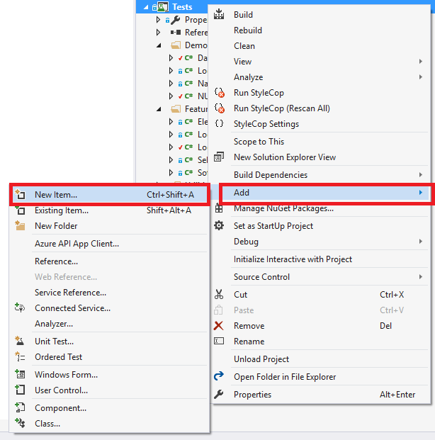
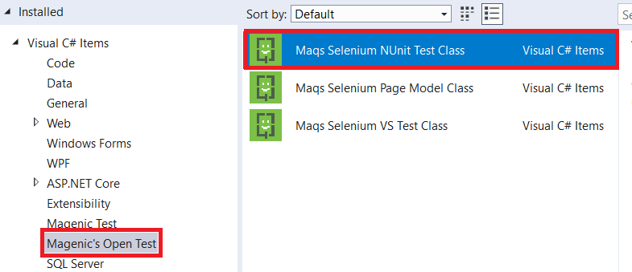

#  Getting Started

## Installation
The first step is to install MAQS.  Checkout the [MAQS Installation](MAQS_5.0.0/Installation) guide.  

## Building Your First Project
After the MAQS Visual Studio Extension has been installed, you're ready to start testing.


1. Go To File > New > Project  
  

2. Under Templates in the side panel, select "Magenic's Open Test" 
  

3. Finally, name the solution whatever you'd like and click "ok".
## Adding a Page Model
To add a new Page Model from a template

1. Right click PageModel project.
2. Click Add ? New Item.  This will open a list of templates.  
  
3. Under Magenic's Open Test select the "MAQS Selenium Page Model Class"
3. Choose a name
4. Click the "Add" Button  
  

This will add a template for a Page Object Model.  The template is filled with sample code and methods.  The methods included are common methods used on every page.
## Adding a Test
### VSTest Test
1. Right click PageModel project.
2. Click Add ? New Item.  This will open a list of templates.  
  
3. Under Magenic's Open Test select the "MAQS Selenium VS Test Class"
3. Choose a name
4. Click the "Add" Button  
  

The VSTest class will generate a template for a VSTest TestClass and include a sample VSTest TestMethod.  When run this will use the VSTest test runner to execute tests.
### NUnit Test
1. Right click PageModel project.
2. Click Add ? New Item.  This will open a list of templates.  
  
3. Expand the Magenic's Open Test and select the NUnit Only
3. Select Maqs Selenium NUnit Test Class
4. Choose a name
5. Click the "Add" Button  



This will generate a template for the NUnit TestFixture with a sample NUnit Test.
## Running Tests
Tests can be run through the command line using MSTest or NUnit, or through Visual Studio using the test explorer.

### Enable Test Explorer
To enable the Test Explorer window
1. Go to Test in the main menu bar
2. Go to Windows in Test
3. Click Text Explorer in Test  


#### Running Tests from Test Explorer
Tests can be run singularliy by right clicking a test and either clicking "Debug Selected Tests" to run in debug mode or clicking "Run Selected Tests" to run the tests normally.

#### Organizing Tests
Tests can be organized to more easily filter through what could potentially be a test solution with thousands of tests.  There are two ways to change the grouping:

Right-click inside the Test Explorer window and select Group By.  


Left-click the Group by button in the top left corner off the Test Explorer, to the left of the Search field.   


##### Adding Traits to tests
An easy way to group tests is to give those tests a trait attribute.  These are written in the test classes.

###### VSTest Traits
Above the test method, either before or after the TestMethod attribute, add another attribute with the TestCategory tag.

Written As
```csharp
[TestCategory(string testCategoryName)]
```

Examples
```csharp
[TestCategory("Smoke Tests")]
```

```csharp
string testCategory = "Login Tests"

[TestCategory(testCategory)]
```
Test methods with multiple TestCategory attributes will add that test case to each attribute group, but the test will only be run once when running all tests.

###### NUnit Traits
Above the test method, either before or after the Test attribute, add another attribute with the Category tag.

Written As
```csharp
[Category(string testCategoryName)]
```

Examples
```csharp
[Category("Smoke Tests")]
```

```csharp
string testCategory = "Login Tests"

[Category(testCategory)]
```
Test methods with multiple Category attributes will add that test case to each attribute group, but the test will only be run once when running all tests.


## Configurations
There are a number of configurations included with MAQS.  Checkout the [MAQS Configurations](MAQS_5.0.0/Configuration.md) guide.