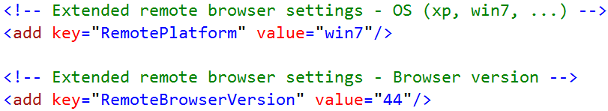

#  Configurations

## Introduction
The below section will cover global test settings.

## Application Configuration
The MAQS project solutions make use of a collection of configurations. These configurations are stored in an XML document called the **app.config**.
The **app.config** file includes configurations for each project solution, as well as generic configurations for handling MAQS specific functions.

### MagenicMaqs - General Test Configurations
General test configurations are included in every project template. They control wait time, time-out, and log levels.
#### Wait Time
Polling time (how long the code waits between retries) used for generic waits in milliseconds.
##### Examples
```xml
<!-- Generic wait time in milliseconds - AKA how long do you wait for rechecking something -->
<add key="WaitTime" value="1000" />
```

#### Timeout
The overall timeout for generic waits in milliseconds.
##### Examples
```xml
<!-- Generic time-out in milliseconds -->
<add key="Timeout" value="10000" />
```

#### Log
This setting dictates if and/or when logs are created. With the default option "Yes," a test will always create a corresponding log after the test finishes. The other options are “No” and “OnFail.” “No” will never create a log under any circumstance, while “OnFail” will only create a log if the test fails.
##### Examples
```xml
 <!-- Do you want to create logs for your tests
<add key="Log" value="YES"/>
<add key="Log" value="NO"/>
<add key="Log" value="OnFail"/>-->
<add key="Log" value="OnFail" />
```
#### Logging Levels
This setting dictates how verbose the logging will be. With the default option, "Information", the log will include everything but Verbose messages. 

Levels
 - Verbose option - Logs everything
 - Information(Default) - Logs informative, generic, success, warning, and error messages
 - Generic - Logs generic, success, warning, and error messages
 - Success - Logs success, warning, and error messages
 - Warning - Logs all warning and error messages
 - Error - Only logs error messages

##### Examples
```xml
<!--Logging Levels
<add key="LogLevel" value="VERBOSE"/>
<add key="LogLevel" value="INFORMATION"/>
<add key="LogLevel" value="GENERIC"/>
<add key="LogLevel" value="SUCCESS"/>
<add key="LogLevel" value="WARNING"/>
<add key="LogLevel" value="ERROR"/>-->
<add key="LogLevel" value="INFORMATION" />
```
#### Logging Types
This setting dictates the format of the log files. 

Types
 - Console - Prints to console logger, no file is created.
 - TXT(Default) - Creates a TXT file.
 - HTML - Creates a HTML file.

##### Examples
```xml
<!-- Logging Types
<add key="LogType" value="CONSOLE"/>
<add key="LogType" value="TXT"/>
<add key="LogType" value="HTML"/>-->
<add key="LogType" value="HTML" />
```

#### Log Output Location - Optional
The log file path can be set to a specific folder or shared drive that the test runner has access to.  
_*By default, logs end up in the "log" folder. This is located in the same folder as the test DLL._

##### Examples
```xml
<!-- Log file path - Defaults to build location if no value is defined
<add key="FileLoggerPath" value="C:\Frameworks\"/>-->
```

### SeleniumMaqs - Selenium Test Configuration
Selenium specific configurations assist in switching between web browsers, setting up remote browser settings, selecting a specific WebDriver, or setting base root information.
#### Local Browser Settings 
This setting dictates which browser is used for Selenium tests. 
- Chrome (Default)
- HeadlessChrome - Chrome running without the UI
- Internet Explorer or IE
- Firefox
- PhantomJS - A headless web browser, this will be depricated in the future
- Edge
- Remote - Tells MAQS it will be running against a grid.  
*See Remote Browser Settings section below if you intend to use Grid

##### Examples
```xml
 <!--Local browser settings
 <add key="Browser" value="Chrome"/>
 <add key="Browser" value="HeadlessChrome"/>
 <add key="Browser" value="Internet Explorer"/>
 <add key="Browser" value="Firefox"/>
 <add key="Browser" value="PhantomJS"/>
 <add key="Browser" value="Edge"/> 
 <add key="Browser" value="Remote"/> -->
 <add key="Browser" value="Chrome" />
```

#### WebDriver Hint Path - Optional
This setting allows you to provide an alternate path for where to find your webdriver.  By default the test will look for the webdriver in it's current folder.  
_*By default, MAQS will only look in the test DLL folder for webdrivers._

##### Examples
```xml
<!-- Web driver hint path override - This is the first place Maqs will try to find your web drive 
<add key="WebDriverHintPath" value="C:\Frameworks"/>-->
```

#### Remote Browser Settings
 
The app.config file can be configured to send tests to a hub for distribution. The “Browser” key needs to have a value set to “Remote.” The “RemoteBrowser” key needs to be set to the web browser that the tests will be run against. Finally, it needs the key “HubUrl” value set to the URL of the hub that will distribute the tests. 
To use these configurations, Selenium Grid hub and node servers must be set up beforehand (see http://www.seleniumhq.org/docs/07_selenium_grid.jsp for more information), or pay services that will provide test environments.
There are additional options for configuring the remote browser environment. You can specify the remote platform to use (Windows, macOS, Linux, etc.), as well as what browser version should be used for the specified remote browser.
  
## Test Settings
"There are two types of file for configuring tests. *.runsettings are used for unit tests. And *.testsettings for lab environment tests, web performance and load tests, and for customizing some types of diagnostic data adapters such as Intellitrace and event log adapters"
https://msdn.microsoft.com/en-us/library/jj635153.aspx

Both test settings files are written in XML (eXtensible Markup Language).
### Run Settings Configurations
A .runsettings file can be added as a test setting to add additional configurations when running unit tests. This allows tests to be run on additional cores on a single machine, to run on different versions of the unit test framework, or to specify where the results of the test should be output.
#### Adding Run Settings
To add a .runsettings file to a test solution, go to the top toolbar and under Test → Test Settings, choose the "Select Test Settings File" option, and finally add a .runsettings file.  
  
Since there is no way to have Visual Studio generate a template of a .runsettings file, you can instead add an example .runsettings file to your solution such as this one found on Microsoft's MSDN website: https://msdn.microsoft.com/en-us/library/jj635153.aspx#example
### Test Settings Configurations
.test settings files are useful for collecting data from tests running across multiple platforms, specifying environmental conditions, or collecting diagnostic data.
.testsettings are always used by default in load tests and web performance tests.
#### Creating Test Settings
To create a .testsettings file, open the context menu on your solution, go to Add → New Item, select the Test Settings category and choose a Test Settings file. A wizard window will appear providing options to be configured for the .testsettings file.  
  
#### Adding Test Settings
To add a .testsettings file to a test solution, go to the top toolbar and under Test → Test Settings, choose the "Select Test Settings File" option, and finally add a .testsettings file.  
  
#### Test Settings for Selenium Grid
The main use of a .testsettings file is to control the distribution of tests over Selenium Grid, allowing tests to be executed in parallel.
### Major Differences
While a .testsettings file can be used in the same way as a .runsettings file to control settings such as framework version, target platform, or a results directory, it is mainly used for controlling the distribution of tests run in parallel over multiple machines.
.testsettings can also be configured to collect other information, such as recording video of the tests running.
.runsettings can only run a test.dll single-threaded, meaning it can only be run on one machine.
.runsettings is negligibly faster than .testsettings, but can only be used to run tests locally.
