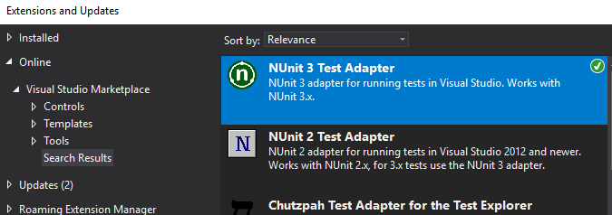

#  SpecFlow required installation

## Requirements
Visual Studio Professional (or Enterprise) 2015 or above.

*We highly recommend using Visual Studio 2017 or above*

## Install SpecFlow for Visual Studio
1. Open Visual Studio and open "Extensions and Updates"  

### 

2. Search for the SpecFlow for Visual Studio extension

### 

3. Open Tools > Options

### 

4. Set the SpecFlow Legacy Option 'Enable SpecFlowSingleFileGenerator Custom Tool' to false.

### 

For more details on this process, check out the [Specflow Documentation](https://specflow.org/2019/generating-code-behind-files-using-msbuild/).

## Install NUnit 3 Test Adapter

1. Search for the NUnit 3 Test Adapter extension

### 